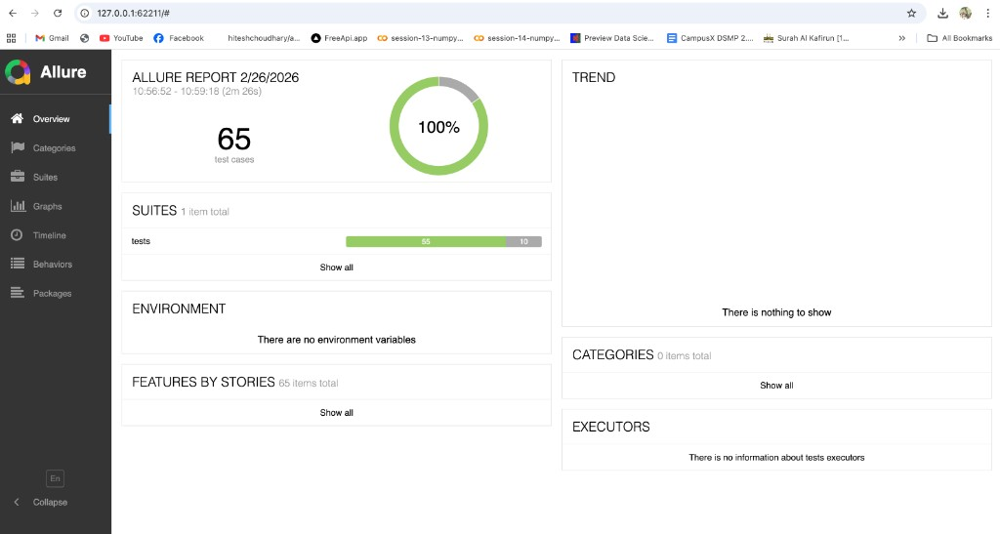
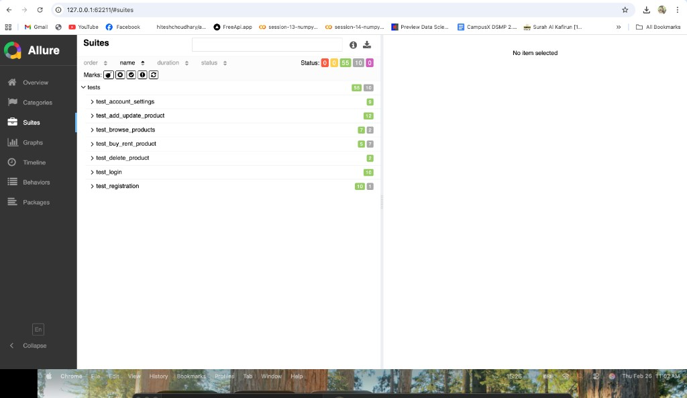
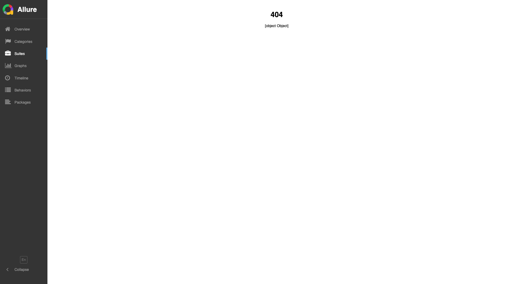

# Playwright Python UI Automation (POM)

Data-driven UI automation framework for a small e-commerce platform using Playwright + Pytest with strict Page Object Model structure.

## Project Structure

- `pages/` -> POM classes and UI actions
- `tests/` -> feature test suites
- `test_data/` -> JSON data sources for data-driven tests
- `reports/` -> runtime outputs (`allure-results`, `allure-report`)
- `config.py` -> global settings loaded from `.env`
- `run_all_tests.py` -> one-command runner for full suite

## Prerequisites

- Python 3.10+ (recommended 3.11)
- `pip`
- Git
- Chrome/Chromium install supported by Playwright

## Setup On Any Device

1. Clone repository

```bash
git clone https://github.com/Maisha-Chowa/Automation-task-Sazim.git
cd Automation-task-Sazim
```

2. Create and activate virtual environment

```bash
python3 -m venv .venv
source .venv/bin/activate
```

3. Install dependencies

```bash
pip install -r requirements.txt
python -m playwright install
```

4. Configure `.env`

Create or update `.env` in project root:

```env
BASE_URL=https://ehsanur-rahman-sazim.github.io/
USERNAME=testuser@teebay.com
PASSWORD=123456
BROWSER=chromium
DEFAULT_TIMEOUT_MS=15000
HEADLESS=false
```

## Run All Tests

```bash
python run_all_tests.py
```

## Allure Report Generation

Pytest is configured to write Allure results to `reports/allure-results`.

1. Execute tests

```bash
python run_all_tests.py
```

2. Generate static report

```bash
allure generate reports/allure-results -o reports/allure-report --clean
```

3. Open report locally

```bash
allure open reports/allure-report
```

## Test Plan Summary

- **Login**
  - UI validation
  - Positive and negative authentication scenarios
  - Logout confirm/cancel behavior

- **Registration**
  - UI validation
  - Positive registration flow
  - Field-level and blank-input negative validations

- **Account Settings**
  - UI validation
  - Positive update and persisted value checks
  - Negative validations

- **Add / Update Product**
  - UI validation
  - Positive create and edit flows
  - Dropdown + pricing validations

- **Delete Product**
  - UI validation
  - Positive delete flow with confirmation modal
  - Post-delete verification on `BASE_URL/my-products`

- **Browse Products**
  - Title/category/buy/rent filter combinations
  - Clear/reset handling between test scenarios

- **Buy / Rent Product (Business Logic Covered)**
  - Status tags handled in tests: `Available`, `Sold`, `Rented`, `You Own the product`.
  - Visibility rules:
    - If product is `Available` -> `Buy` and `Rent` buttons should be visible.
    - If product is `Sold` -> `Buy` and `Rent` buttons should not be visible.
    - If product is `Rented` -> `Buy` and `Rent` buttons should not be visible.
    - If product is `You Own the product` -> `Buy` and `Rent` buttons should not be visible.
    - If product is both owned and available -> `Buy` and `Rent` buttons should not be visible.
  - Buy flow:
    - `Buy` opens confirmation modal.
    - Confirm buy moves status to sold and hides actions.
    - Cancel buy keeps status available and actions visible.
  - Rent flow:
    - `Rent` opens modal with start/end date and `Book rent`/`Cancel`.
    - Valid date ranges are covered including max 1 week case.
    - Invalid inputs covered: past date, same start/end, end before start, empty dates, duration > 1 week.
    - Cancel rent keeps status available.
  - Known application issues are tracked as `xfail` where business rule behavior is not enforced by the app.

## Allure Report Screenshots





## How To Capture Allure Report Screenshots

1. Run tests and generate report:
   - `python run_all_tests.py`
   - `allure generate reports/allure-results -o reports/allure-report --clean`
2. Open report:
   - `allure open reports/allure-report`
3. Capture screenshots from:
   - Dashboard/Overview
   - Suites view
   - Individual test details with steps/attachments
4. Save files under `docs/screenshots/` using these exact names:
   - `allure-overview.png`
   - `allure-suites.png`
   - `allure-test-details.png`

## Notes

- Some scenarios are intentionally `xfail` where app behavior is currently inconsistent with expected business rules.
- Use `.env` to switch users/base URL without code changes.

